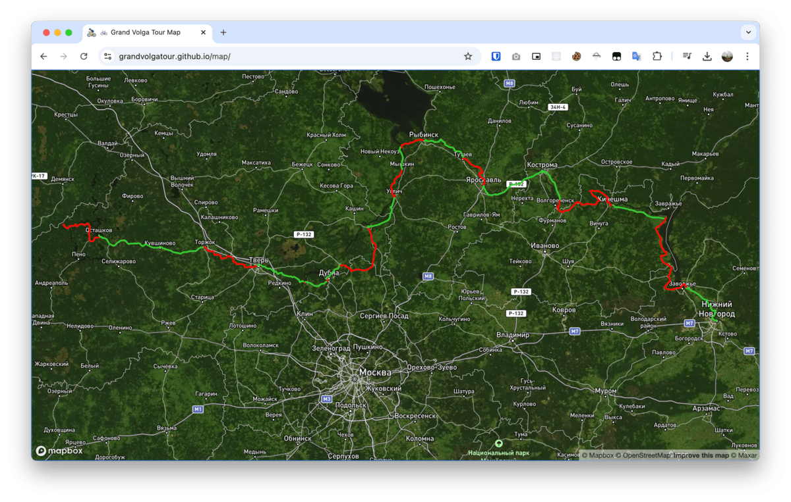

<link rel="icon" href="bicyclist.png" type="image/png">

# 🚴‍♂️ Grand Volga Tour

Описание

https://grandvolgatour.github.io/

## 🗺 Карта маршрута

[https://grandvolgatour.github.io/map/](https://grandvolgatour.github.io/map/)

## 🏆 Квалификационные этапы

 - Основные этапы:
   - Осташковский (Осташков - Тверь) [209 км]
   - Конаковский (Тверь - Калязин) [212 км]
   - Рыбинский (Калязин - Ярославль) [256 км]
   - Костромской (Ярославль - Кинешма) [240 км]
   - Нижегородский (Кинешма - Нижний) [256 км]

    Суммарно: 1175 км.

 - Экстра этапы:
   - Исток Волги (Осташков - Волговерховье - Осташков) [145 км]

    
    Cуммарно 1318 км.

### Категории Квалификации

 - #### Полная квалификация - 1318 км.
   - Проехать все участки 💪
   
 - #### Основная квалификация - 1175 км.
    - Проехать 4 из 5 основных этапов.
    - Допускается пропуск одного отрезка в каждом этапе.

### 🚀 Старт и финиш
 - В ключевых пунктах маршрута
 - Если не хватает времени, не получается доехать в центр города, то на удобной ЖД или авто станции этого города.
 - Проезжать отрезки можно в любом порядке, непоследовательно

## 🌠 Ключевые пункты маршрута

###  📍 Осташков {#gvt-1-ostashkov}
 - Старая колокольня в центральном парке
 - [https://yandex.ru/maps/-/CHQ1v4Ip](https://yandex.ru/maps/-/CHQ1v4Ip)
 - 57.155667, 33.100617
 - 

### 📍 Торжок {#gvt-2-torzhok}
 - Пешеходный старый вантовый мост рядом с памятником Н.А. Львову
 - [https://yandex.ru/maps/-/CHQ1vFIA](https://yandex.ru/maps/-/CHQ1vFIA)
 - 57.040948, 34.961115
 - 

### 📍 Тверь {#gvt-3-tver}
 - Памятник А.С. Пушкину на набережной Волги
 - [https://yandex.ru/maps/-/CHQ1vF1J](https://yandex.ru/maps/-/CHQ1vF1J)
 - 56.863514, 35.901868
 - 

 - ##### 🚢 Переправа Топорок (с тверской стороны напротив Конаково) {#gvt-3.1-toporok}
    - [https://yandex.ru/maps/-/CHQLzZOi](https://yandex.ru/maps/-/CHQLzZOi)
    - 56.705118, 36.712557
    - 

 - ##### 🚢 Переправа Зеленый Бор. В Конаково {#gvt-3.2-zelbor}
    - [https://yandex.ru/maps/-/CHQLzZ9K](https://yandex.ru/maps/-/CHQLzZ9K)
    - 56.695921, 36.732630
    - 

   

### 📍 Конаково {#gvt-4-konakovo}
 - Сосновый бор и смотровая площадка
 - [https://yandex.ru/maps/-/CHQLzZYB](https://yandex.ru/maps/-/CHQLzZYB)
 - 56.705108, 36.749283
 - 

 - ##### 🚢 Переправа через канал (Конаковский берег) {#gvt-4.1-kanal}
   - [https://yandex.ru/maps/-/CHQLzKnn](https://yandex.ru/maps/-/CHQLzKnn)
   - 56.713778, 37.132807
   - 

 - ##### 🚢 Переправа через канал (Дубненский берег) {#gvt-4.2-kanal}
   - [https://yandex.ru/maps/-/CHQLzKp9](https://yandex.ru/maps/-/CHQLzKp9)
   - 56.714377, 37.134082
   - 
   

   
### 📍 Дубна {#gvt-5-dubna}
 - Памятник В.И. Ленину
 - [https://yandex.ru/maps/-/CHQ1vSkg](https://yandex.ru/maps/-/CHQ1vSkg)
 - 56.730965, 37.124717
 - 

### 📍 Кимры (Савелово) {#gvt-6-kimry}
 - Песчаная набережная на стороне вокзала
 - [https://yandex.ru/maps/-/CHQ1zR5U](https://yandex.ru/maps/-/CHQ1zR5U)
 - 56.857229, 37.365838
 - 

### 📍 Калязин {#gvt-7-kalyazin}
 - Смотровая площадка на набережной с видом колокольни
 - [https://yandex.ru/maps/-/CHQ1j8-m](https://yandex.ru/maps/-/CHQ1j8-m)
 - 57.241691, 37.855486
 - 

### 📍Углич {#gvt-8-uglich}
 - Пристань на набережной
 - [https://yandex.ru/maps/-/CHQ1j2Jx](https://yandex.ru/maps/-/CHQ1j2Jx)
 - 57.530853, 38.320916
 - 

### 📍Мышкин {#gvt-9-myshkin}
 - Пристань с торговыми рядами
 - [https://yandex.ru/maps/-/CHQ1nB5a](https://yandex.ru/maps/-/CHQ1nB5a)
 - 57.785985, 38.457988
 - 

 - #### 🚢 Переправа в Солнцево. На Мышкинской стороне {#gvt-9.1-solntsevo}
   - [https://yandex.ru/maps/-/CHQ1nFPi](https://yandex.ru/maps/-/CHQ1nFPi)
   - 57.986915, 38.424874
   - 

   
 - #### 🚢 Переправа в Глебово. Со стороны Рыбинска {#gvt-9.2-glebovo}
   - [https://yandex.ru/maps/-/CHQ1nJOC](https://yandex.ru/maps/-/CHQ1nJOC)
   - 57.986355, 38.449303
   - 

    
### 📍 Рыбинск {#gvt-10-rybinsk}
 - Пристань на набережной 
 - [https://yandex.ru/maps/-/CHQ1nN0A](https://yandex.ru/maps/-/CHQ1nN0A)
 - 58.050167, 38.854570
 - 

### 📍 Тутаев (Романовская сторона) {#gvt-11-tutayev}
 - Смотровая площадка храма и Волги (напротив дома Дмитриева с красивым видом на Казанскую-Преображенскую церковь)
 - [https://yandex.ru/maps/-/CHQ1nR5U](https://yandex.ru/maps/-/CHQ1nR5U)
 - 57.880701, 39.535863
 - 

### 📍 Ярославль {#gvt-12-yaroslavl}
 - Смотровая площадка на стрелке
 - [https://yandex.ru/maps/-/CHQ1nZIS](https://yandex.ru/maps/-/CHQ1nZIS)
 - 57.621442, 39.904190
 - 

### 📍 Кострома {#gvt-13-kostroma}
 - Сусанинская площадь в центре
 - [https://yandex.ru/maps/-/CHQ1nKoI](https://yandex.ru/maps/-/CHQ1nKoI)
 - 57.767815, 40.926999
 - 

 - #### 📍🚢 Переправа Красное на Волге. Пристань {#gvt-13.1-krasnoe-pozhni}
   - [https://yandex.ru/maps/-/CHQ1n88Q](https://yandex.ru/maps/-/CHQ1n88Q)
   - 57.494938, 41.233934
   - 

 - #### 📍🚢 Переправа Красные Пожни. Пристань {#gvt-13.2-pozhni-ples}
   - [https://yandex.ru/maps/-/CHQ1n0Yf](https://yandex.ru/maps/-/CHQ1n0Yf)
   - 57.486621, 41.234187
   - 

### 📍 Плёс {#gvt-14-ples}
 - Памятник Ф.И. Шаляпину на набережной
 - [https://yandex.ru/maps/-/CHQ1nD1I](https://yandex.ru/maps/-/CHQ1nD1I)
 - 57.461264, 41.513416
 - 

### 📍🚢 Плёс. Пристань в Гравийном карьере {#gvt-14.1-krasnoe-grav}
 - На другой стороне от Плеса
 - [https://yandex.ru/maps/-/CHQ1nHNV](https://yandex.ru/maps/-/CHQ1nHNV)
 - 57.463015, 41.539350
 - 
  

### 📍Кинешма {#gvt-15-kineshma}
 - Смотровая площадка на стрелке
 - [https://yandex.ru/maps/-/CHQ1nSiE](https://yandex.ru/maps/-/CHQ1nSiE)
 - 57.443752, 42.174053
 - 

### 📍 Юрьевец {#gvt-16-yurevets}
 - Центральная площадь рядом с Георгиевской колокольней
 - [https://yandex.ru/maps/-/CHQ1nL6O](https://yandex.ru/maps/-/CHQ1nL6O)
 - 57.318713, 43.111136
 - 

### 📍 Городец {#gvt-17-gorodets}
 - Памятник Александру Невскому на смотровой площадке
 - [https://yandex.ru/maps/-/CHQ1rI7u](https://yandex.ru/maps/-/CHQ1rI7u)
 - 56.641548, 43.464703
 - 

### 📍 Нижний Новгород {#gvt-18-nnovgorod}
 - Чкаловская лестница рядом с Кремлем (памятник В.П. Чкалова)
 - [https://yandex.ru/maps/-/CHQ1rMmn](https://yandex.ru/maps/-/CHQ1rMmn)
 - 56.330028, 44.009432
 - 

## etc.

