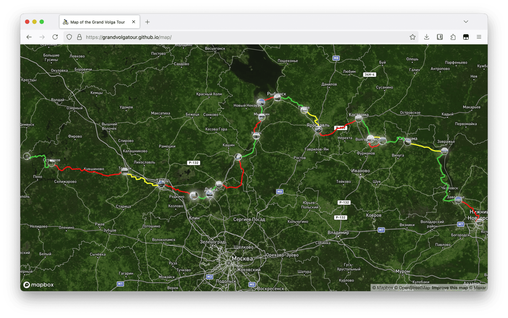
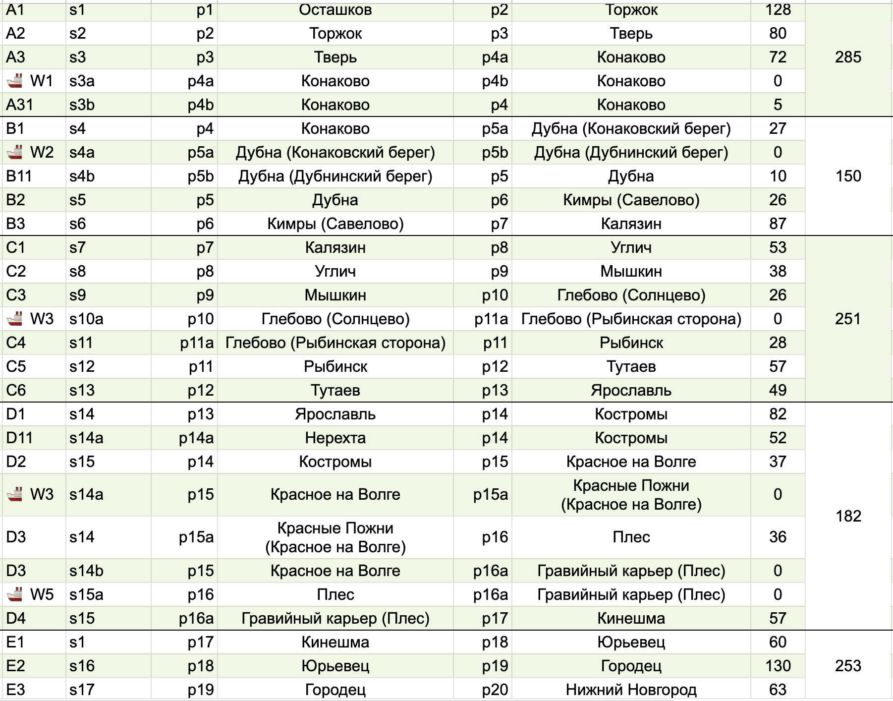

<link rel="stylesheet" type="text/css" href="custom-style.css">

# 🚴‍♂️ Grand Volga Tour

### Волжский Гранд Тур

Описание

https://grandvolgatour.github.io/

## 🗺 Карта маршрута

[map/](map/)

Маршрут разбит на небольшие сегменты по кратчайшему и удобному способу навигации.

Один сегмент очень удобно проезжать за один день или полдня.

## 🏆 Квалификационные этапы

 - Основные этапы:
   - A. Осташковский (Осташков - Тверь) [209 км]
   - B. Конаковский (Тверь - Калязин) [212 км]
   - C. Рыбинский (Калязин - Ярославль) [256 км]
   - D. Костромской (Ярославль - Кинешма) [240 км]
   - E. Нижегородский (Кинешма - Нижний) [256 км]

# S-A7

# Waypoint P89
# Location L876

    Суммарно: 1175 км.

 - Экстра этапы:
   - Исток Волги (Осташков - Волговерховье - Осташков) [145 км]

    
    Cуммарно 1318 км.

[https://docs.google.com/spreadsheets/d/1z5-CzmRIbPkew-f6SSFUgQ3wbhUkAabSoU6qMdtF9dg/edit?usp=sharing](https://docs.google.com/spreadsheets/d/1z5-CzmRIbPkew-f6SSFUgQ3wbhUkAabSoU6qMdtF9dg/edit?usp=sharing)

[https://docs.google.com/spreadsheets/d/e/2PACX-1vT8h9m4AnF9oQbkU9akU3kSo-2bf9v3fLYsoSmiwfcqbyZicdwBpAp7kJ79bJNfqG314GIYlWrbcg-b/pubhtml?gid=1064073865&single=true](https://docs.google.com/spreadsheets/d/e/2PACX-1vT8h9m4AnF9oQbkU9akU3kSo-2bf9v3fLYsoSmiwfcqbyZicdwBpAp7kJ79bJNfqG314GIYlWrbcg-b/pubhtml?gid=1064073865&single=true)

### Категории Квалификации

 - #### Полная квалификация - 1318 км.
   - Проехать все участки 💪
   
 - #### Основная квалификация - 1175 км.
    - Проехать 4 из 5 основных этапов.
    - Допускается пропуск одного отрезка в каждом этапе.

### 🚀 Старт и финиш
 - В ключевых пунктах маршрута
 - Если не хватает времени, не получается доехать в центр города, то на удобной ЖД или авто станции этого города.
 - Проезжать отрезки можно в любом порядке, непоследовательно

#### 🧮 Классификация сегментов

 - **Тип покрытия:** 
   - 🛣 Асфальт
   - Ямочная
   - 🪵 Проселочная
   - 🚜 Грейдер
   - * Хорошая обочина
 - **Дорожный трафик:**
   - 🚛 Интенсивынй с фурами
   - 🚙 Нормальный
   - 🛵 Редкие автомобили
   - 🌾 Почти никого
- **География**
  - 🛤 Плоская
  - 🏔 Гористая
  - 🏞 Красивые виды

## Ключевые пункты маршрута 🌠

###  📍 Волговерховье {#p0}
- \* Специальный дополнителньый отрезок
- Исток Волги
- [https://yandex.ru/maps/-/CHQXb0mh](https://yandex.ru/maps/-/CHQXb0mh)
- 57.251332, 32.467774
- {: .wide-image }

### 🧭 A0 Сегмент. От Осташкова до Волговреховья (круговой) {#s0}

Путь сложный с грейдером.

###  📍 Осташков {#p1}
 - Старая колокольня в центральном парке
 - [https://yandex.ru/maps/-/CHQ1v4Ip](https://yandex.ru/maps/-/CHQ1v4Ip)
 - 57.155667, 33.100617
 - {: .wide-image }

### 🧭 A1 Сегмент. От Осташкова до Торжка {#s1}

route

### 📍 Торжок {#p2}
 - Пешеходный старый вантовый мост рядом с памятником Н.А. Львову
 - [https://yandex.ru/maps/-/CHQ1vFIA](https://yandex.ru/maps/-/CHQ1vFIA)
 - 57.040948, 34.961115
 - {: .wide-image }

### 🧭 A2 Сегмент. От Торжка до Твери {#s2}

route

### 📍 Тверь {#p3}
 - Памятник А.С. Пушкину на набережной Волги
 - [https://yandex.ru/maps/-/CHQ1vF1J](https://yandex.ru/maps/-/CHQ1vF1J)
 - 56.863514, 35.901868
 - {: .wide-image }

### 🧭 A3 Сегмент. От Твери до парома в Топорок {#s3}

route

##### 🚢 Переправа Топорок (с тверской стороны напротив Конаково) {#p3a} 
 - [https://yandex.ru/maps/-/CHQLzZOi](https://yandex.ru/maps/-/CHQLzZOi)
 - 56.705118, 36.712557
 - {: .wide-image }

##### 🚢 Переправа Зеленый Бор. В Конаково {#p3b} 
 - [https://yandex.ru/maps/-/CHQLzZ9K](https://yandex.ru/maps/-/CHQLzZ9K)
 - 56.695921, 36.732630
 - {: .wide-image }

### 🧭 А3.1 (короткий) Сегмент. От переправы Зеленый бор до Конаково смотровой площадки  {#s3a}

route

### 📍 Конаково {#p4}
 - Сосновый бор и смотровая площадка
 - [https://yandex.ru/maps/-/CHQLzZYB](https://yandex.ru/maps/-/CHQLzZYB)
 - 56.705108, 36.749283
 - {: .wide-image }

### 🧭 B1 Сегмент. От Конаково до переправы через канал им. Москвы в Дубне {#s4}

route

##### 🚢 Переправа через канал (Конаковский берег) {#p4a}
 - [https://yandex.ru/maps/-/CHQLzKnn](https://yandex.ru/maps/-/CHQLzKnn)
 - 56.713778, 37.132807
 - {: .wide-image }

##### 🚢 Переправа через канал (Дубненский берег) {#p4b} 
 - [https://yandex.ru/maps/-/CHQLzKp9](https://yandex.ru/maps/-/CHQLzKp9)
 - 56.714377, 37.134082
 - {: .wide-image }

### 🧭 B1.1 Сегмент. От переправы через канал им. Москвы до Дубны памятника Ленину {#s4a}

route
 

  
### 📍 Дубна {#p5}
 - Памятник В.И. Ленину
 - [https://yandex.ru/maps/-/CHQ1vSkg](https://yandex.ru/maps/-/CHQ1vSkg)
 - 56.730965, 37.124717
 - {: .wide-image }

### 🧭 B2 Сегмент. От Конаково до Кимр по левому (северному) берегу {#s5}

route

### 📍 Кимры (Савелово) {#p6}
 - Песчаная набережная на стороне вокзала
 - [https://yandex.ru/maps/-/CHQ1zR5U](https://yandex.ru/maps/-/CHQ1zR5U)
 - 56.857229, 37.365838
 - {: .wide-image }

### 🧭 B3 Сегмент. От Кимр до Калязина {#s6}

Сложный участок рекомендуется проехать на пригородном поезде или поезде дальнего следования.

route

### 📍 Калязин {#p7}
 - Смотровая площадка на набережной с видом колокольни
 - [https://yandex.ru/maps/-/CHQ1j8-m](https://yandex.ru/maps/-/CHQ1j8-m)
 - 57.241691, 37.855486
 - {: .wide-image }

**Калязин** — уютный провинциальный городок на берегу Волги, который идеально подойдёт для короткой остановки в велопутешествии. Его тишина, атмосферные улочки и уникальные достопримечательности сделают вашу поездку запоминающейся.

Первое, что обязательно стоит увидеть, — затопленная колокольня Никольского собора. Это архитектурное чудо возвышается посреди воды, создавая завораживающий вид. Вы можете полюбоваться колокольней с берега или, если позволяет время, взять лодочную экскурсию, чтобы увидеть её ближе.

Для любителей необычных объектов — радиотелескоп РТ-64, одно из крупнейших астрономических сооружений в России. Его впечатляющий масштаб заметен даже издалека, и он добавляет нотку современности в историческую атмосферу города.

Калязин — это город, где можно немного замедлиться: перекусить на берегу Волги, сделать фотографии на фоне колокольни и вдохнуть дух русской провинции. Даже короткий визит сюда подарит новые эмоции и силы для продолжения вашего пути.

### 🧭 C1 Сегмент. От Калязина до Углича {#s7}

Проходит по дороге со средним движением пересекющей границу Тверской и Ярославской области.

### 📍Углич {#p8}
 - Пристань на набережной
 - [https://yandex.ru/maps/-/CHQ1j2Jx](https://yandex.ru/maps/-/CHQ1j2Jx)
 - 57.530853, 38.320916
 - {: .wide-image }

### 🧭 C2 Сегмент. От Углича до Мышкина по северному берегу {#s8}

Красивый сегмент без машин очень спокйоный.

По пути есть несколько мест на берегу для ночевки.

### 📍Мышкин {#p9}
 - Пристань с торговыми рядами
 - [https://yandex.ru/maps/-/CHQ1nB5a](https://yandex.ru/maps/-/CHQ1nB5a)
 - 57.785985, 38.457988
 - {: .wide-image }

### 🧭 С3 Сегмент. От Мышкина до ст. Волга {#s9}

Короткий маршрут без машин

### 🧭 Переправа от Солнцево до Глебово {#s9a}

#### 🚢 Переправа в Солнцево. На Мышкинской стороне {#p9a} 
 - [https://yandex.ru/maps/-/CHQ1nFPi](https://yandex.ru/maps/-/CHQ1nFPi)
 - 57.986915, 38.424874
 - {: .wide-image }

   
#### 🚢 Переправа в Глебово. Со стороны Рыбинска {#p9b} 
 - [https://yandex.ru/maps/-/CHQ1nJOC](https://yandex.ru/maps/-/CHQ1nJOC)
 - 57.986355, 38.449303
 - {: .wide-image }

### 🧭 С4 Сегмент. От Глебово до Рыбинска {#s9}

Тяжелая дорога с большим трафиком.

### 📍 Рыбинск {#p10}
 - Пристань на набережной 
 - [https://yandex.ru/maps/-/CHQ1nN0A](https://yandex.ru/maps/-/CHQ1nN0A)
 - 58.050167, 38.854570
 - {: .wide-image }

### 🧭 C5 Сегмент. От Рыбинска до Тутаева романовской стороны по северной стороне {#s10}

Очень красивый маршрут совершенно без машин по красивым извилистым местам.

С заездом в прекрасный город Тутаев и его Романовской стороне.

Любимое место И. Левитана на Волге.

### 📍 Тутаев (Романовская сторона) {#p11}
 - Смотровая площадка храма и Волги (напротив дома Дмитриева с красивым видом на Казанскую-Преображенскую церковь)
 - [https://yandex.ru/maps/-/CHQ1nR5U](https://yandex.ru/maps/-/CHQ1nR5U)
 - 57.880701, 39.535863
 - {: .wide-image }

### 🧭 C6 Сегмент. От Тутаева до Ярославля {#s11}

Красивый маршрут без автомобилей с заездом в Тутаев красивый город и монастырю Толга около Ярославля.

### 📍 Ярославль {#p12}
 - Смотровая площадка на стрелке
 - [https://yandex.ru/maps/-/CHQ1nZIS](https://yandex.ru/maps/-/CHQ1nZIS)
 - 57.621442, 39.904190
 - {: .wide-image }

### 🧭 D1 Сегмент. От Ярославля до {#s12}

Сложный сегмент с большой дорогой и автомобилями.

Рекомендуется добратсья до Костромы на электричке или поезде.

Или также проехать до Нерехты, а оттуда по приятной дороге без машин.

### 📍 Нерехта {#p12a}
- ??
- [https://yandex.ru/maps/-/CHad7ClO](https://yandex.ru/maps/-/CHad7ClO)
- 57.462546, 40.572427
- {: .wide-image }

### 🧭 D11 Сегмент. От Нерехты до Костромы {#s12a}

Хороший прекрасный сегмент. 

### 📍 Кострома {#p13}
 - Сусанинская площадь в центре
 - [https://yandex.ru/maps/-/CHQ1nKoI](https://yandex.ru/maps/-/CHQ1nKoI)
 - 57.767815, 40.926999
 - {: .wide-image }

### 🧭 D2 Сегмент. От Костромы до Красное на Волге {#s13}

Спокойная и приятная дорога.

#### 📍🚢 Переправа Красное на Волге. Пристань {#p13a}
 - [https://yandex.ru/maps/-/CHQ1n88Q](https://yandex.ru/maps/-/CHQ1n88Q)
 - 57.494938, 41.233934
 - {: .wide-image }

#### 📍🚢 Переправа Красные Пожни. Пристань {#p13b} 
 - [https://yandex.ru/maps/-/CHQ1n0Yf](https://yandex.ru/maps/-/CHQ1n0Yf)
 - 57.486621, 41.234187
 - {: .wide-image }

### 🧭 Переправа в Красное на Волге {#s13a}

route

### 🧭 Сегмент {#s14}

route

### 📍 Плёс {#p14}
 - Памятник Ф.И. Шаляпину на набережной
 - [https://yandex.ru/maps/-/CHQ1nD1I](https://yandex.ru/maps/-/CHQ1nD1I)
 - 57.461264, 41.513416
 - {: .wide-image }

### 🧭 Сегмент {#s14}

route

#### 📍🚢 Плёс. Пристань в Гравийном карьере {#p14a}
 - На другой стороне от Плеса
 - [https://yandex.ru/maps/-/CHQ1nHNV](https://yandex.ru/maps/-/CHQ1nHNV)
 - 57.463015, 41.539350
 - {: .wide-image }

### 🧭 Переправа {#s14a}

### 🧭 D4 Сегмент. От Плеса до Кинешмы {#s14}

Интересный маршрут с кусочком гравия. Красивые виды.

#### 📍Кинешма {#p15}
 - Смотровая площадка на стрелке
 - [https://yandex.ru/maps/-/CHQ1nSiE](https://yandex.ru/maps/-/CHQ1nSiE)
 - 57.443752, 42.174053
 - {: .wide-image }

### 🧭 E1 Сегмент. От Кинешмы до Юрьевца {#s1}

Приятный маршрут

### 📍 Юрьевец {#p16}
 - Центральная площадь рядом с Георгиевской колокольней
 - [https://yandex.ru/maps/-/CHQ1nL6O](https://yandex.ru/maps/-/CHQ1nL6O)
 - 57.318713, 43.111136
 - {: .wide-image }

### 🧭 E2 Сегмент. От Юрьевца до Городца (Заволжье) {#s16}

Очень приятный и спокойный маршрут

### 📍 Городец {#p17}
 - Памятник Александру Невскому на смотровой площадке
 - [https://yandex.ru/maps/-/CHQ1rI7u](https://yandex.ru/maps/-/CHQ1rI7u)
 - 56.641548, 43.464703
 - {: .wide-image }

### 🧭 E3 Сегмент. От Городца до Нижнего Новгорода {#s17}

Хороший и красивый маршрут.

### 📍 Нижний Новгород {#p18}
 - Чкаловская лестница рядом с Кремлем (памятник В.П. Чкалова)
 - [https://yandex.ru/maps/-/CHQ1rMmn](https://yandex.ru/maps/-/CHQ1rMmn)
 - 56.330028, 44.009432
 - {: .wide-image }

## Железные дороги вокруг маршрута 🚄

### 🚂 Бологое - Осташков {#rw1}
[https://rasp.yandex.ru/all-transport/bologoe--ostashkov](https://rasp.yandex.ru/all-transport/bologoe--ostashkov)

### 🚂 Осташков - Кувшиново {#rw1a}
https://rasp.yandex.ru/all-transport/

### 🚂 Торжок - Тверь {#rw2}
https://rasp.yandex.ru/all-transport/

### 🚂 Кимры (Савелово) - Калязин {#rw7}
https://rasp.yandex.ru/all-transport/

### 🚂 Калязин - Углич {#rw8}
https://rasp.yandex.ru/all-transport/

### 🚂 Калязин - ст. Волга (Глебово) {#rw9}
https://rasp.yandex.ru/all-transport/

### 🚂 ст. Волга (Глебово) - Рыбинск {#rw10}
https://rasp.yandex.ru/all-transport/

### 🚂 Рыбинск - Тутаев - Ярославль {#rw11}
https://rasp.yandex.ru/all-transport/

### 🚂 Ярославль - Нерехта (на поезде) {#rw12}
https://rasp.yandex.ru/all-transport/

### 🚂 Нерехта - Кострома (на поезде) {#rw123}
https://rasp.yandex.ru/all-transport/

### 🚂 Заволжье (Городец) - Нижний Новгород (на поезде){#rw18}
https://rasp.yandex.ru/all-transport/

## ETC

