<link rel="stylesheet" type="text/css" href="custom-style.css">

# 🚴‍♂️ Волжский Гранд Тур (Volga Grand Tour)

https://grandvolgatour.github.io/

### 🗺 Карта маршрута

[https://grandvolgatour.github.io/map/](map/)

### Table of content
 - Выгодные преимущества
 - 🏆 Квалификационные этапы
 - Категории Квалификации
 - 🧮 Классификация сегментов
 - [A0 Сегмент. Осташков - Волговреховье (круговой) 142 км. суммарно](#a0)
 - [A1. Осташков - Торжок 128 км. ](#a1)
 - [A2. Торжок - Тверь 80 км. ](#a2)
 - [A3. Тверь - Конаково 72 км. ](#a3)
 - [B1. Конаково - Дубна 29 км. ](#b1)
 - [B2. Дубна - Кимры (Савелово) 35 км. ](#b2)
 - [B3. Кимры (Савелово) - Калязин 87 км. ](#b3)
 - [C1. Калязин - Углич 54 км. ](#c1)
 - [C2. Углич - Мышкин 38 км. ](#c2)
 - [С3. Мышкин - ст. Волга 26 км. ](#c3)
 - [С4. Станция Волга - Рыбинск 28 км. ](#c4)
 - [C5. Рыбинск - Тутаев 57 км. ](#c5)
 - [C6. Тутаев - Ярославль 49 км. ](#c6)
 - [D1. Ярославль - Кострома 82 км. ](#d1)
 - [D11. Нерехта - Кострома 52 км. ](#d11)
 - [D2. Кострома - Красное на Волге 37 км. ](#d2)
 - [D3. Красное на Волге - Плёс 36 км. ](#d3)
 - [D4. Плёс - Кинешма 57 км. ](#d4)
 - [E1. Кинешма - Юрьевец 60 км. ](#e1)
 - [E2. Юрьевец - Городец 130 км. ](#e2)
 - [E3. Городец - Нижнего Новгорода 63 км. ](#e3)

## Выгодные преимущества

- Историчность.
  - Старе города
  - Золотое кольцо
  - Главная река центральной полосы
  - Множество интересных точек по самому маршруту
- Экологичность и географичность
  - Вдоль большой реки
  - Без дорого с трафиком
  - В экологически чистых местах
  - Множество водоемов и маленьких речек по пути
  - Переправы через Волгу на пароме и другие интересные препятствия
- Транспортная доступность
  - Через крупнейшие города цнетральной полосы
  - Можно приехать на множестве поездов
  - Сложные участки проехать на электричке
- Возможность комбинировать
  - Очень удобное разбиение по сегментам
  - Легко останавливатьс на отдых
- Велосипедные характеристики:
  - Асфалтовые покрытия
  - Гравайные и песчание местами
  - Проселочные дорожки
  - Тропинки вдоль реки
  - Магазины с продуктами по маршруту
  - Один сегмент очень удобно проезжать за один день или полдня.
- Etc
  - Множество отелей и возможность проехать маршрут полностью с отстановкой в отелях
  - Безопасность.
  - Открытость с апреля по октябрь

### Маршрут и участки

- A - Осташковский [209 км]
  - Осташков - Торжок - Тверь
- B - Конаковский [212 км]
  - Тверь - Конаково - Дубна - Калязин
- C - Рыбинский [256 км]
  - Калязин - Углич - Мышкин - Рыбинск - Тутаев - Ярославль
- D - Костромской [240 км]
  - Ярославль - Кострома - Плес - Кинешма
- E - Нижегородский [256 км]
  - Кинешма - Юрьевец - Городец - Нижний Новгород

Итого: 1120 км

**Экстра сегмент вдоль Селигера**

- Исток Волги (круговой) [145 км суммарно]
  - Осташков - Волговерховье - Осташков

Итого: 1250 км

### Таблица всех сегментов

[https://docs.google.com/spreadsheets/d/1z5-CzmRIbPkew-f6SSFUgQ3wbhUkAabSoU6qMdtF9dg/edit?usp=sharing](https://docs.google.com/spreadsheets/d/1z5-CzmRIbPkew-f6SSFUgQ3wbhUkAabSoU6qMdtF9dg/edit?usp=sharing)

[https://docs.google.com/spreadsheets/d/e/2PACX-1vT8h9m4AnF9oQbkU9akU3kSo-2bf9v3fLYsoSmiwfcqbyZicdwBpAp7kJ79bJNfqG314GIYlWrbcg-b/pubhtml?gid=1064073865&single=true](https://docs.google.com/spreadsheets/d/e/2PACX-1vT8h9m4AnF9oQbkU9akU3kSo-2bf9v3fLYsoSmiwfcqbyZicdwBpAp7kJ79bJNfqG314GIYlWrbcg-b/pubhtml?gid=1064073865&single=true)

## Ключевые пункты маршрута 🌠

###  📍 Волговерховье {#p0}

Волговерховье — место, где берет начало великая река Волга. 

Здесь, среди тишины лесов и чистых родников, находится уютный храм у святого источника и древний Волговерховский монастырь. 

Уединённая атмосфера, красивая природа и ощущение прикосновения к истокам делают это место по-настоящему особенным.

{:class="wide-image"}

**Waypoint:**  
Исток Волги  
57.251332, 32.467774  
[https://yandex.ru/maps/-/CHQXb0mh](https://yandex.ru/maps/-/CHQXb0mh){:target="_blank"}

## 🧭 A0 Сегмент. Осташков - Волговреховье (круговой) [142 км. суммарно]{#a0}

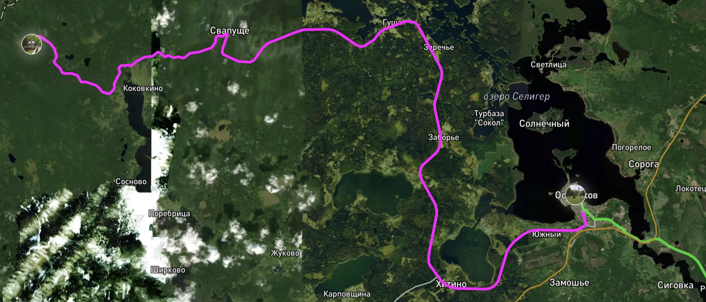{:class="wide-image"}

Путь сложный с грейдером.

###  📍 Осташков {#p1}

Осташков — уютный город на берегу Селигера, где природа и история создают идеальное место для отдыха.
Здесь можно отправиться в водное путешествие по озеру, посетить величественную Нило-Столобенскую пустынь,
прогуляться по старинным улочкам и насладиться тишиной русской глубинки.

{:class="wide-image"}

**Waypoint:**  
Старая колокольня в центральном парке  
57.155667, 33.100617  
[https://yandex.ru/maps/-/CHQ1v4Ip](https://yandex.ru/maps/-/CHQ1v4Ip){:target="_blank"}

## 🧭 A1. Осташков - Торжок [128 км.] {#a1}

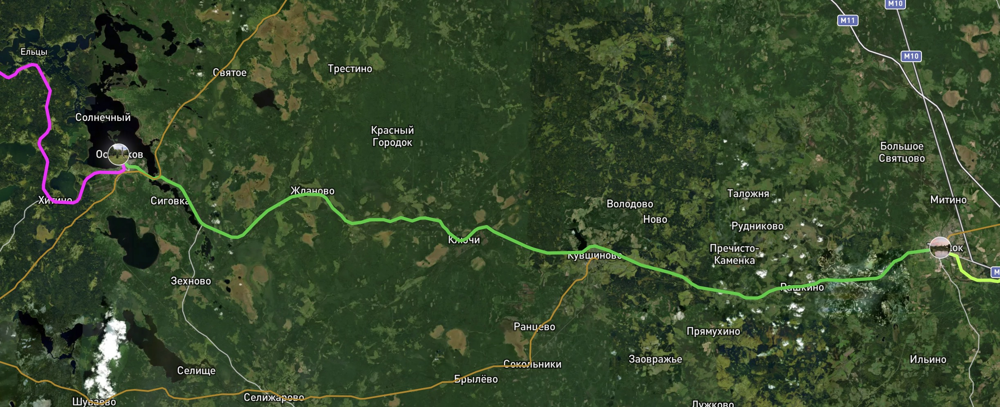{:class="wide-image"}

###  Торжок {#p2}

Торжок — старинный город с неповторимым русским колоритом. 
Здесь можно увидеть величественные золотые купола Борисоглебского монастыря, пройтись по старинным мостам через Тверцу и заглянуть в дом-музей поэта Николая Львова. 

Торжок славится традицией золотного шитья, а в местных ресторанах стоит попробовать знаменитые пожарские котлеты.
Город очаровывает своей историей, уютной атмосферой и красотой провинциальной России.

**Waypoint:**  
Пешеходный старый вантовый мост рядом с памятником Н.А. Львову  
57.040948, 34.961115  
[https://yandex.ru/maps/-/CHQ1vFIA](https://yandex.ru/maps/-/CHQ1vFIA){:target="_blank"}

## 🧭 A2. Торжок - Тверь [80 км.] {#a2}

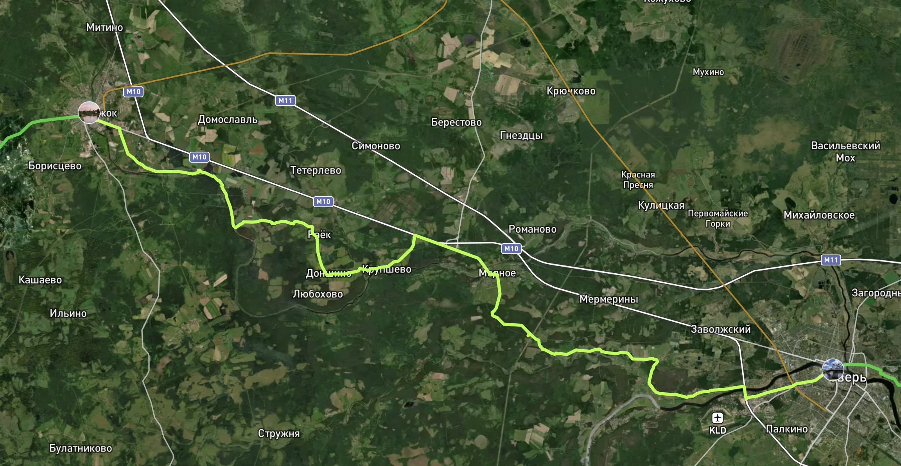{:class="wide-image"}

route

### Тверь {#p3}

{:class="wide-image"}

**Waypoint:**  
Памятник А.С. Пушкину на набережной Волги  
56.863514, 35.901868  
[https://yandex.ru/maps/-/CHQ1vF1J](https://yandex.ru/maps/-/CHQ1vF1J){:target="_blank"}

## 🧭 A3. Тверь - Конаково [72 км.] {#a3}

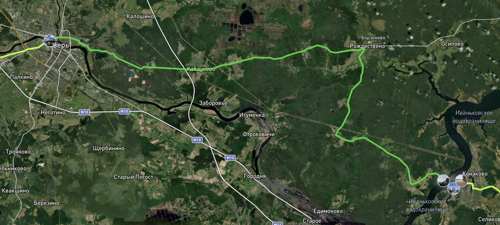{:class="wide-image"}

route

**Waypoint:**  
#### 🚢 Паромная переправа Топорок {#river-1}  
56.705118, 36.712557  
[https://yandex.ru/maps/-/CHQLzZOi](https://yandex.ru/maps/-/CHQLzZOi){:target="_blank"}

{:class="wide-image"}

#### 🚢 Переправа Зеленый Бор. В Конаково {#p3b}  
56.695921, 36.732630  
[https://yandex.ru/maps/-/CHQLzZ9K](https://yandex.ru/maps/-/CHQLzZ9K){:target="_blank"}

{:class="wide-image"}

### 📍 Конаково {#p4}

{:class="wide-image"}

**Waypoint:**  
Сосновый бор и смотровая площадка  
56.705108, 36.749283  
[https://yandex.ru/maps/-/CHQLzZYB](https://yandex.ru/maps/-/CHQLzZYB){:target="_blank"}

## 🧭 B1. Конаково - Дубна [29 км.] {#b1}

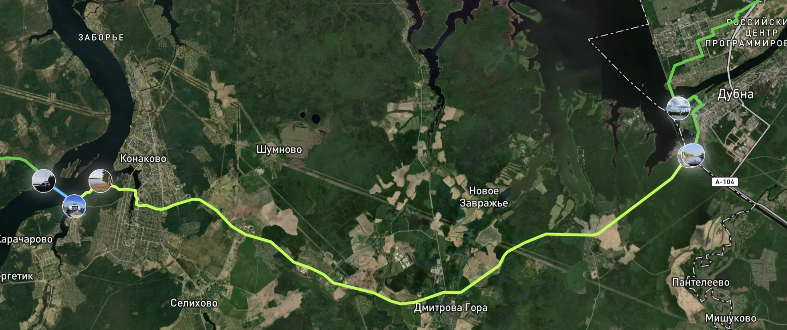

route

**Waypoint:**  
#### 🚢 Переправа через канал (Конаковский берег) {#river-2}
56.713778, 37.132807  
[https://yandex.ru/maps/-/CHQLzKnn](https://yandex.ru/maps/-/CHQLzKnn){:target="_blank"}

{:class="wide-image"}

#### 🚢 Переправа через канал (Дубненский берег) {#p4b}  
56.714377, 37.134082  
[https://yandex.ru/maps/-/CHQLzKp9](https://yandex.ru/maps/-/CHQLzKp9){:target="_blank"} 

{:class="wide-image"}
 

### 📍 Дубна {#p5}

{:class="wide-image"}

**Waypoint:**  
Памятник В.И. Ленину  
56.730965, 37.124717  
[https://yandex.ru/maps/-/CHQ1vSkg](https://yandex.ru/maps/-/CHQ1vSkg){:target="_blank"}

## 🧭 B2. Дубна - Кимры (Савелово) [35 км.] {#b2}

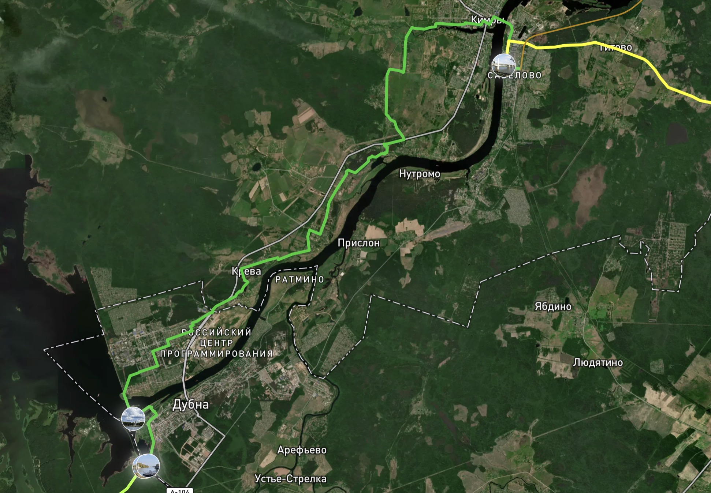{:class="wide-image"}

route

### 📍 Кимры (Савелово) {#p6}

{:class="wide-image"}

**Waypoint:**  
Песчаная набережная на стороне вокзала  
56.857229, 37.365838  
[https://yandex.ru/maps/-/CHQ1zR5U](https://yandex.ru/maps/-/CHQ1zR5U){:target="_blank"}

## 🧭 B3. Кимры (Савелово) - Калязин [87 км.] {#b3}

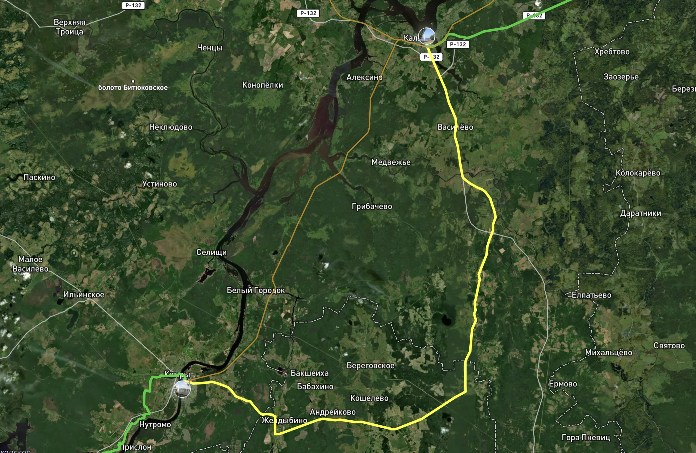{:class="wide-image"}

Сложный участок рекомендуется проехать на пригородном поезде или поезде дальнего следования.

route

### 📍 Калязин {#p7}

**Калязин** — уютный провинциальный городок на берегу Волги, который идеально подойдёт для короткой остановки в велопутешествии. Его тишина, атмосферные улочки и уникальные достопримечательности сделают вашу поездку запоминающейся.

{:class="wide-image"}

Первое, что обязательно стоит увидеть, — затопленная колокольня Никольского собора. Это архитектурное чудо возвышается посреди воды, создавая завораживающий вид. Вы можете полюбоваться колокольней с берега или, если позволяет время, взять лодочную экскурсию, чтобы увидеть её ближе.

Для любителей необычных объектов — радиотелескоп РТ-64, одно из крупнейших астрономических сооружений в России. Его впечатляющий масштаб заметен даже издалека, и он добавляет нотку современности в историческую атмосферу города.

Калязин — это город, где можно немного замедлиться: перекусить на берегу Волги, сделать фотографии на фоне колокольни и вдохнуть дух русской провинции. Даже короткий визит сюда подарит новые эмоции и силы для продолжения вашего пути.

**Waypoint:**  
Смотровая площадка на набережной с видом колокольни  
57.241691, 37.855486  
[https://yandex.ru/maps/-/CHQ1j8-m](https://yandex.ru/maps/-/CHQ1j8-m){:target="_blank"}

## 🧭 C1. Калязин - Углич [54 км.] {#c1}

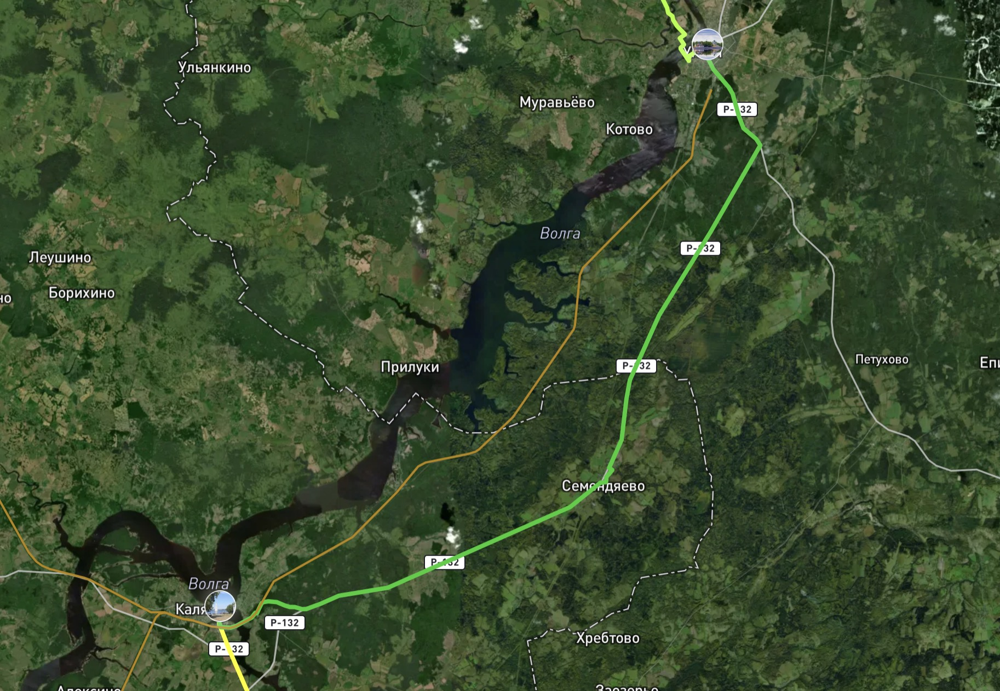{:class="wide-image"}

Проходит по дороге со средним движением пересекющей границу Тверской и Ярославской области.

### 📍Углич {#p8}

{:class="wide-image"}

**Waypoint:**  
Пристань на набережной  
57.530853, 38.320916  
[https://yandex.ru/maps/-/CHQ1j2Jx](https://yandex.ru/maps/-/CHQ1j2Jx)

## 🧭 C2. Углич - Мышкин [38 км.] {#c2}

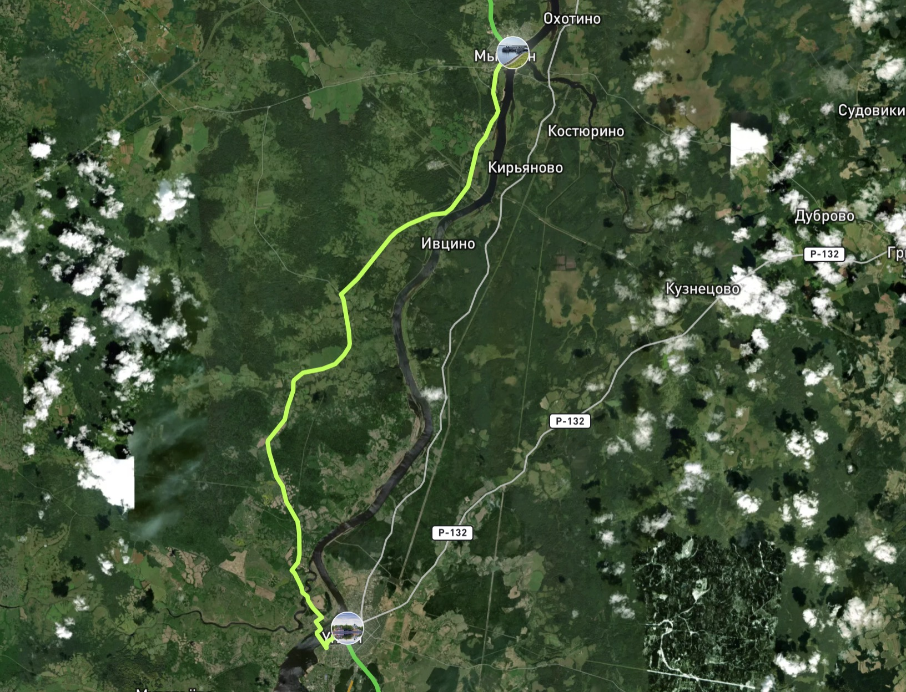{:class="wide-image"}

Красивый сегмент без машин очень спокйоный.

По пути есть несколько мест на берегу для ночевки.

### 📍Мышкин {#p9}

{:class="wide-image"}

**Waypoint:**  
Пристань с торговыми рядами  
57.785985, 38.457988  
[https://yandex.ru/maps/-/CHQ1nB5a](https://yandex.ru/maps/-/CHQ1nB5a)

## 🧭 С3. Мышкин - ст. Волга [26 км.] {#c3}

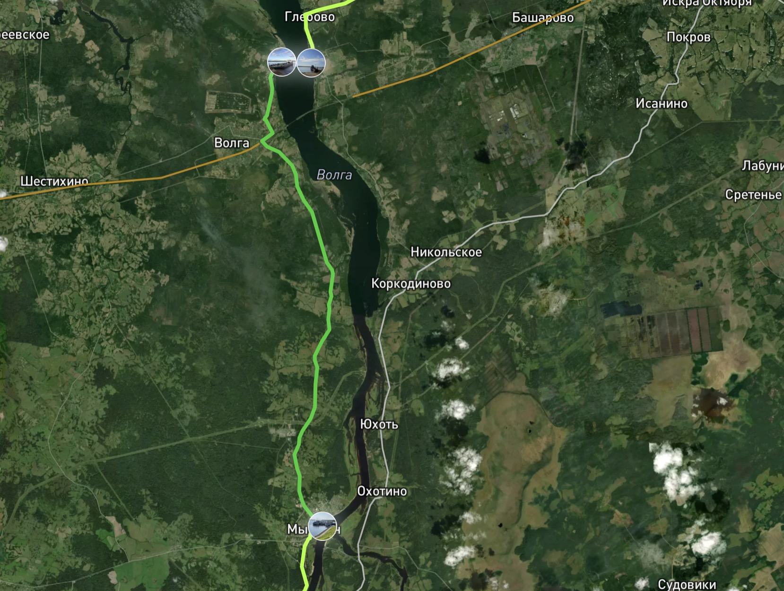{:class="wide-image"}

Короткий маршрут без машин

**Waypoint:**  
#### 🚢 Паромная переправа рядом со станцией Волга. Солнцево - Глебово {#river-3}  
57.986915, 38.424874  
[https://yandex.ru/maps/-/CHQ1nFPi](https://yandex.ru/maps/-/CHQ1nFPi)

{:class="wide-image"}

#### 🚢 Переправа в Глебово. Со стороны Рыбинска {#p9b}  
57.986355, 38.449303  
[https://yandex.ru/maps/-/CHQ1nJOC](https://yandex.ru/maps/-/CHQ1nJOC)

{:class="wide-image"}

## 🧭 С4. Станция Волга - Рыбинск [28 км.] {#c4}

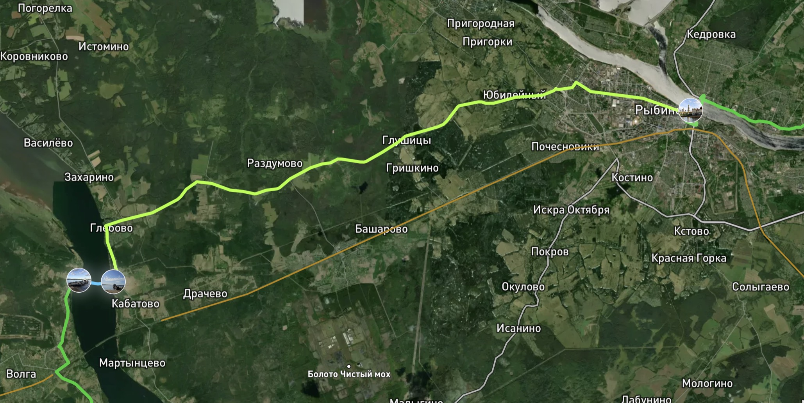

Тяжелая дорога с большим трафиком.

### 📍 Рыбинск {#p10}

{:class="wide-image"}

**Waypoint:**  
Пристань на набережной  
58.050167, 38.854570  
[https://yandex.ru/maps/-/CHQ1nN0A](https://yandex.ru/maps/-/CHQ1nN0A)

## 🧭 C5. Рыбинск - Тутаев [57 км.] {#c5}

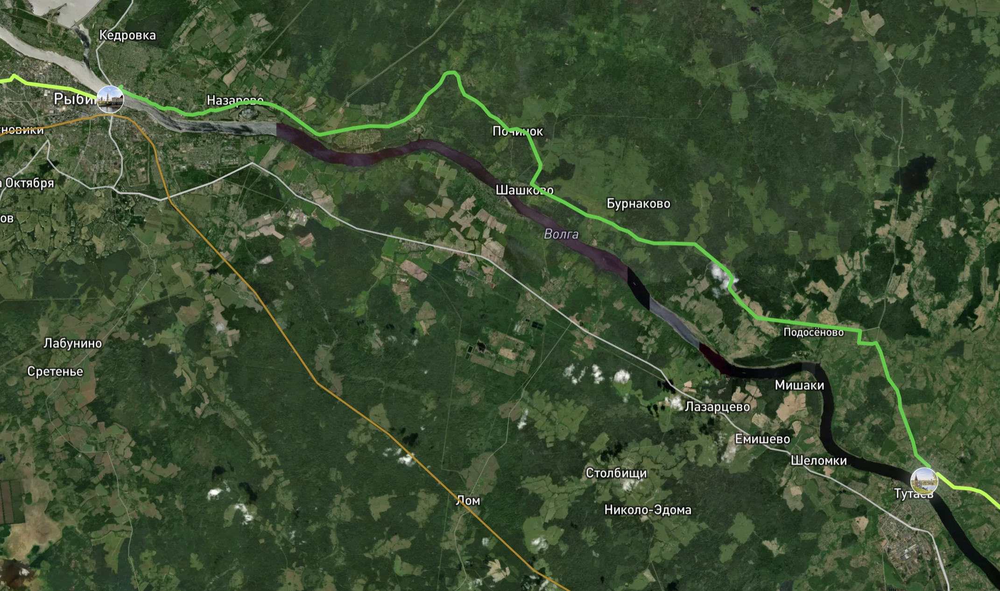{:class="wide-image"}

Очень красивый маршрут совершенно без машин по красивым извилистым местам.

С заездом в прекрасный город Тутаев и его Романовской стороне.

Любимое место И. Левитана на Волге.

### 📍 Тутаев (Романовская сторона) {#p11}

{:class="wide-image"}

**Waypoint:**  
Смотровая площадка храма и Волги (напротив дома Дмитриева с красивым видом на Казанскую-Преображенскую церковь)  
57.880701, 39.535863  
[https://yandex.ru/maps/-/CHQ1nR5U](https://yandex.ru/maps/-/CHQ1nR5U)

## 🧭 C6. Тутаев - Ярославль [49 км.] {#c6}

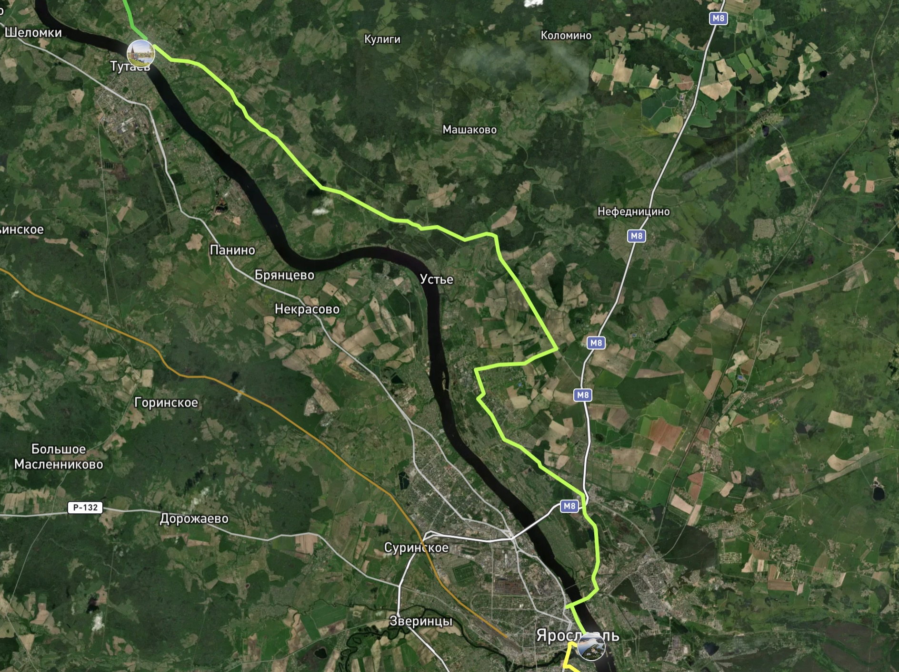{:class="wide-image"}

Красивый маршрут без автомобилей с заездом в Тутаев красивый город и монастырю Толга около Ярославля.

### 📍 Ярославль {#p12}

{:class="wide-image"}

**Waypoint:**  
Смотровая площадка на стрелке  
57.621442, 39.904190  
[https://yandex.ru/maps/-/CHQ1nZIS](https://yandex.ru/maps/-/CHQ1nZIS)

## 🧭 D1. Ярославль - Кострома [82 км.] {#d1}

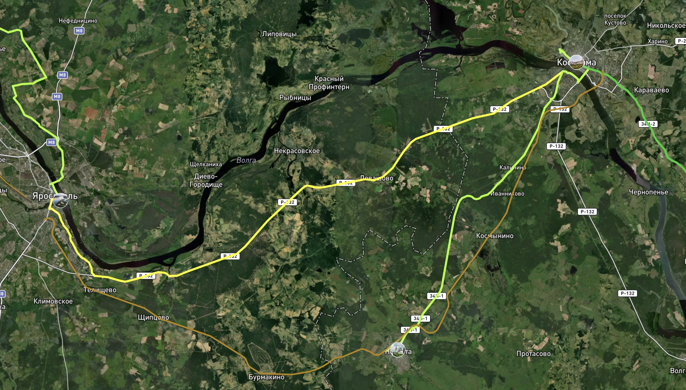{:class="wide-image"}

Сложный сегмент с большой дорогой и автомобилями.

Рекомендуется добратсья до Костромы на электричке или поезде.

Или также проехать до Нерехты, а оттуда по приятной дороге без машин.

### 📍 Нерехта {#p12a}

{:class="wide-image"}

**Waypoint:**  
??  
57.462546, 40.572427  
[https://yandex.ru/maps/-/CHad7ClO](https://yandex.ru/maps/-/CHad7ClO)

## 🧭 D11. Нерехта - Кострома [52 км.] {#d11}

Хороший прекрасный сегмент. 

### 📍 Кострома {#p13}

{:class="wide-image"}

**Waypoint:**  
Сусанинская площадь в центре, Кострома  
57.767815, 40.926999  
[https://yandex.ru/maps/-/CHQ1nKoI](https://yandex.ru/maps/-/CHQ1nKoI)

## 🧭 D2. Кострома - Красное на Волге [37 км.] {#d2}

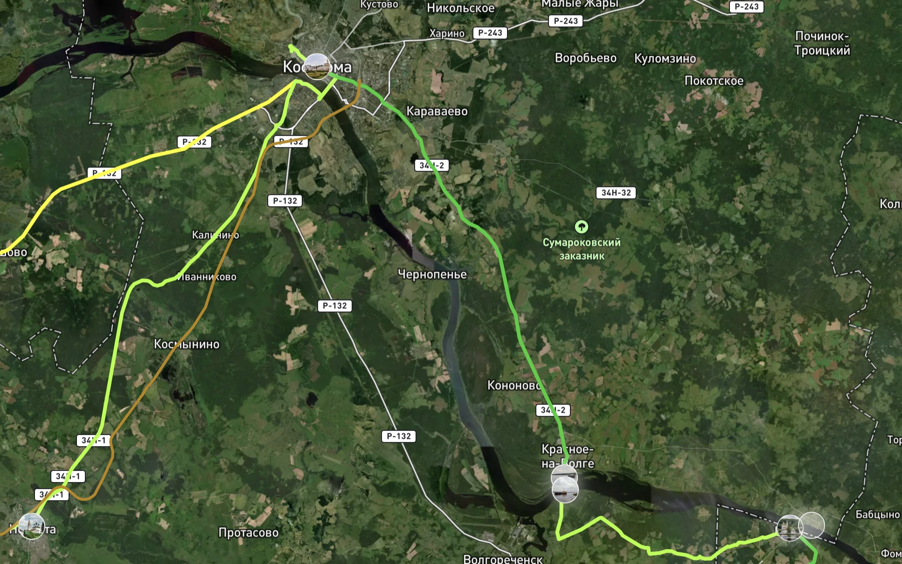{:class="wide-image"}

Спокойная и приятная дорога.

**Waypoint:**  
#### 📍🚢 Переправа Красное на Волге. Пристань {#river-4}
57.494938, 41.233934  
[https://yandex.ru/maps/-/CHQ1n88Q](https://yandex.ru/maps/-/CHQ1n88Q)

{:class="wide-image"}

####  📍🚢 Переправа Красные Пожни. Пристань {#p13b}  
57.486621, 41.234187  
[https://yandex.ru/maps/-/CHQ1n0Yf](https://yandex.ru/maps/-/CHQ1n0Yf)  

{:class="wide-image"}

## 🧭 D3. Красное на Волге - Плёс [36 км.] {#d3}

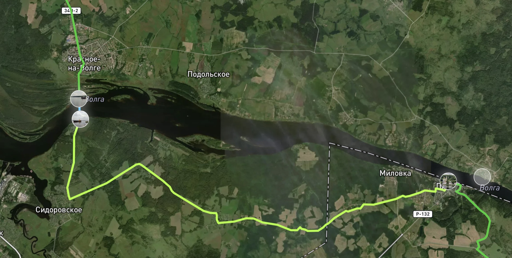{:class="wide-image"}

route

### 📍 Плёс {#p14}

{:class="wide-image"}

**Waypoint:**  
Памятник Ф.И. Шаляпину на набережной  
57.461264, 41.513416  
[https://yandex.ru/maps/-/CHQ1nD1I](https://yandex.ru/maps/-/CHQ1nD1I)

## 🧭 D4. Плёс - Кинешма [57 км.] {#d4}

Интересный маршрут с кусочком гравия. Красивые виды.

#### 📍Кинешма {#p15}

{:class="wide-image"}

**Waypoint:**
Смотровая площадка на стрелке  
57.443752, 42.174053  
[https://yandex.ru/maps/-/CHQ1nSiE](https://yandex.ru/maps/-/CHQ1nSiE)

## 🧭 E1. Кинешма - Юрьевец [60 км.] {#e1}

Приятный маршрут

### 📍 Юрьевец {#p16}

{:class="wide-image"}

**Waypoint:**  
Центральная площадь рядом с Георгиевской колокольней  
57.318713, 43.111136  
[https://yandex.ru/maps/-/CHQ1nL6O](https://yandex.ru/maps/-/CHQ1nL6O)

## 🧭 E2. Юрьевец - Городец [130 км.] {#e2}

Очень приятный и спокойный маршрут

### 📍 Городец {#p17}

{:class="wide-image"}

**Waypoint:**  
Памятник Александру Невскому на смотровой площадке  
56.641548, 43.464703  
[https://yandex.ru/maps/-/CHQ1rI7u](https://yandex.ru/maps/-/CHQ1rI7u)

## 🧭 E3. Городец - Нижнего Новгорода [63 км.] {#e3}

Хороший и красивый маршрут.

### 📍 Нижний Новгород {#p18}

{:class="wide-image"}

**Waypoint:**  
Чкаловская лестница рядом с Кремлем (памятник В.П. Чкалова)  
56.330028, 44.009432  
[https://yandex.ru/maps/-/CHQ1rMmn](https://yandex.ru/maps/-/CHQ1rMmn)

## 🚂 Логистика и железные дороги 

####  Бологое - Осташков {#rw1}

[https://rasp.yandex.ru/all-transport/bologoe--ostashkov](https://rasp.yandex.ru/all-transport/bologoe--ostashkov)

#### Осташков - Кувшиново {#rw1a}

https://rasp.yandex.ru/all-transport/

#### Торжок - Тверь {#rw2}

https://rasp.yandex.ru/all-transport/

#### Кимры (Савелово) - Калязин {#rw7}

https://rasp.yandex.ru/all-transport/

#### Калязин - Углич {#rw8}

https://rasp.yandex.ru/all-transport/

#### Калязин - ст. Волга (Глебово) {#rw9}

https://rasp.yandex.ru/all-transport/

#### Станция Волга (Глебово) - Рыбинск {#rw10}

https://rasp.yandex.ru/all-transport/

#### Рыбинск - Тутаев - Ярославль {#rw11}

https://rasp.yandex.ru/all-transport/

#### Ярославль - Нерехта (на поезде) {#rw12}

https://rasp.yandex.ru/all-transport/

#### Нерехта - Кострома (на поезде) {#rw123}

https://rasp.yandex.ru/all-transport/

#### Заволжье (Городец) - Нижний Новгород (на поезде){#rw18}

https://rasp.yandex.ru/all-transport/

# etc

### Категории Квалификации

- #### Полная квалификация - 1318 км.
   - Проехать все участки 💪

- #### Основная квалификация - 1175 км.
   - Проехать 4 из 5 основных этапов.
   - Допускается пропуск одного отрезка в каждом этапе.

### 🚀 Старт и финиш
- В ключевых пунктах маршрута
- Если не хватает времени, не получается доехать в центр города, то на удобной ЖД или авто станции этого города.
- Проезжать отрезки можно в любом порядке, непоследовательно

#### 🧮 Классификация сегментов

- **Тип покрытия:**
   - 🛣 Асфальт
   - Ямочная
   - 🪵 Проселочная
   - 🚜 Грейдер
   - * Хорошая обочина
- **Дорожный трафик:**
   - 🚛 Интенсивынй с фурами
   - 🚙 Нормальный
   - 🛵 Редкие автомобили
   - 🌾 Почти никого
- **География**
   - 🛤 Плоская
   - 🏔 Гористая
   - 🏞 Красивые виды

